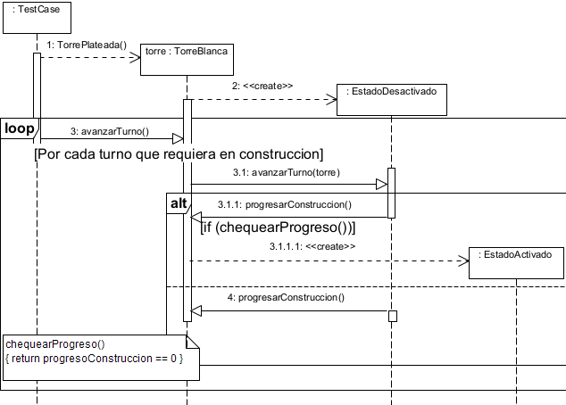

<!--
Link a google docs para ver el informe: https://docs.google.com/document/d/13T3bP0Rvs13mjeTZq3B0dRh9En3OLh_HDWBtm41YBCA/edit?usp=sharing
-->

<h1>
 [75.07 / 95.02]

 Algoritmos y programacion III

</h1>

<h2>
 Trabajo practico 2: AlgoDefense
</h2>
  

### Estudiantes:

| Nombre                   | Padron | Mail                 |
| ------------------------ | ------ | -------------------- |
| Otero Silvera Maximiliano| 108634 | motero@fi.uba.ar     |
| Pla Tomas Alberto        | 106705 | tpla@fi.uba.ar       |
| Oviedo Ignacio Sebastian | 109821 | ioviedo@fi.uba.ar    |
| Fernandez Lucas          | 109250 | lufernandez@fi.uba.ar|
| Velurtas Joaquin Mateo   | 109655 | jvelurtas@fi.uba.ar  |

### Tutor: Diego Sanchez
   
___________________________________________

## 
 Supuestos 

<dl>
    <dt> <h3>Largada y Meta </h3> </dt>
        <dd align="justify">
            Se tomó a la primera pasarela registrada como la Largada y a la última en registrarse como la Meta.
        </dd>

 
    <dt> <h3> TrampaArenosa y Topo </h3> </dt>
        <dd align="justify">
            Un topo al pasar por una TrampaArenosa cambia su estado EsSubterraneo a NoEsSubterraneo y resulta vulnerable ante las torres.
        </dd>
 
    <dt> <h3> Parcela y defensa destruida </h3> </dt>
        <dd align="justify">
            Al destruirse una defensa, la parcela queda ocupada por la misma en su estado destruido por lo cual esa parcela queda ‘inutilizada’.
        </dd>
 
    <dt> <h3> Estadísticas no mencionadas </h3> </dt>
        <dd align="justify">
            Algunas estadísticas no mencionadas en el enunciado (ej. energía de Topo) se tomaron arbitrariamente. 
        </dd>
 
    <dt> <h3> Ataques de TrampaArenosa </h3> </dt>
        <dd align="justify">
            La TrampaArenosa resultaba muy complicada de utilizar ya que para poder ralentizar un enemigo este justo debia caer en la parcela en la cual estaba colocada la misma. Por lo cual decidimos en que si el enemigo al moverse pasa por la trampa este se vea ralentizado. 
        </dd>
</dl>

   

___

 <h2> Detalles de implementacion </h2> 

 

    El modelado para la solución de este problema consta de una clase Partida, con la cual interactúa el usuario a través de la GUI además de iterar sobre la clase Turno para que el juego actúe. La Partida está compuesta por un objeto Mapa y Turno, dependiendo de CreadorMapa para crear el mapa. 

    Mapa compuesto de parcelas, delega a la Parcela que le indica Partida la construcción de una Defensa, dependiendo de qué clase de Defensa y que clase de Parcela se trate se aceptará la defensa o se arroja una excepción. 

    Parcela usa a Posición para saber en qué parte del mapa está ubicada, además es una abstracción la cual heredan Tierra, Pasarela, Meta, Largada, Rocoso cumpliendo la relación ‘es un’. Las parcelas se encargan de contener los enemigos que se encuentran en tal posición.

    En el caso de Tierra y Pasarela pueden aceptar una defensa (TorreBlanca (y sus subclases) y TrampaArenosa resp. en caso contrario se arroja una excepción) la construcción de la misma es delegada a Construible (interfaz la cual implementan EsConstruible y NoEsConstruible) [Concluyendo con esta delegación en un patrón de diseño State, se utilizó este patrón ya que este tipo de Parcela tienen dos estados construible y no construible, y nos permite resolver de forma polimórfica este caso de la construcción].

    Por otro lado, Turno tiene un Jugador el cual está compuesto por Créditos al cual le delega todo lo relacionado a el dinero del juego, el Jugador en sí se encarga de recibir daño de Enemigo(s).

    Turno tiene un Camino el cual lo utiliza para aparecer los enemigos y pasarselo a Enemigo(s). Para saber qué enemigos aparecer Turno depende de CreadorEnemigos el cual requiere el número del turno para saber que tipo de enemigos y que cantidad crear.

    Camino está compuesto por Parcela(s), generalmente Pasarela(s) aunque hay excepciones las cuales utiliza un tipo de enemigo (Lechuza). Camino se encarga de delegar a las parcelas la administración de los enemigos, por su parte sabe mover a los enemigos a la parcela indicada.

    Turno además, tiene Enemigo(s) y Defensa(s) las cuales les indica en cada turno que deben actuar.

    Defensa es una abstracción que delega a la interfaz SaludDefensa la administración por turno de la misma (a SaludDefensa la implementan Operativa y Destruida) [Este caso también es una implementación del patrón State ya que tenemos ambos estados de la Defensa y necesitamos resolverlos de manera polimórfica]. A Defensa la heredan TorreBlanca y TrampaArenosa.

    TrampaArenosa delega a ObjetivoTrampa el buscar a qué objetivos atacar (lista de enemigos) y luego de atacar tres veces esta pasará a su estado Destruida.

    TorreBlanca delega a ObjetivoTorre el buscar a qué objetivo atacar (el más cercano a la misma), antes de poder atacar la torre se encuentra en un EstadoDesactivado y luego de X turnos se cambia a EstadoActivado, ambos estados saben administrar por turno que hacer [Otro caso de utilización del patrón State (interfaz de nombre Estado)]. A TorreBlanca la heredan NoTorre [Patrón NullObject, ya que hay casos en los que se requiere una torre como objetivo pero puede que el jugador no haya construido una torre aún] y TorrePlateada (una mejora en estadísticas de TorreBlanca).

    Por otro lado, Enemigo es una abstracción que utiliza el patrón State, al igual que las Defensa(s) la interfaz SaludEnemigo (que la implementan Vivo y Muerto), además implementa dos patrones Strategy, la interfaz Volador (que la implementan NoEsVolador y EsVolador) y la interfaz Subterráneo (que la implementan NoEsSubterraneo y EsSubterraneo). La razón de esta elección de patrones es resolver de forma polimórfica los casos.

    A Enemigo lo heredan Arania, NoEnemigo [patrón NullObject, misma razón que para NoTorre], Hormiga, Topo y Lechuza.

    Lechuza tiene asociado ObjetivoLechuza ya que le delega la decisión de a que defensa atacar. Lechuza para saber por dónde moverse depende de Ruta, una interfaz la cual implementan RutaL y RutaH. Clases las cuales dependen de CreadorCaminoL y CreadorCaminoH respectivamente para otorgarle a la lechuza el camino que requiere.

    Por último, SingleLogger es el Logger del juego el cual implementa el patrón de diseño singleton para estar disponible globalmente a cambio de romper el principio de única responsabilidad.

   

___________

 <h2> Excepciones </h2> 

  

<dl>
    <dt> <h3>CreditosInsuficientesError </h3> </dt>
        <dd align="justify">
            Esta excepción analiza el caso en el que los créditos a gastar superen a los créditos actuales, en caso afirmativo se lanza la excepción.
        </dd>

 
    <dt> <h3> DefensaEnTerrenoErroneoError </h3> </dt>
        <dd align="justify">
            Esta excepción analiza el caso en el que se quiera colocar una instancia de defensa de un tipo no compatible con la parcela, en caso afirmativo se lanza la excepción
        </dd>
 
    <dt> <h3> EnemigoNoRalentizableError </h3> </dt>
        <dd align="justify">
            Esta excepción la lanza un enemigo al querer ralentizarlo y no se pueda.
        </dd>
 
    <dt> <h3> GanarPartidaError </h3> </dt>
        <dd align="justify">
            Esta excepción analiza el caso en el que la lista de enemigos no tiene ningún enemigo restante, en caso afirmativo se lanza la excepción.
        </dd>
 
    <dt> <h3> PerderPartidaError </h3> </dt>
        <dd align="justify">
            Esta excepción analiza el caso en el que el jugador tiene vida menor o igual a cero, en caso afirmativo se lanza la excepción.
        </dd>
  
    <dt> <h3> SpawnNoEnLargadaError </h3> </dt>
        <dd align="justify">
            Esta excepción la lanzan todas las parcelas excluyendo la Largada al querer utilizar el método aparecerEnemigos().
        </dd>
 
    <dt> <h3> TerrenoDeConstruccionInvalidoError </h3> </dt>
        <dd align="justify">
            Esta excepción la lanzan todas las parcelas excluyendo Tierra y Pasarela al querer utilizar el método construir().
        </dd>
</dl>

   

_______________

<h2> Diagramas de Clase </h2>

  

   

____________

<h2> Diagramas de Secuencia </h2>

  

    De los casos de uso planteados en el enunciado, rescatamos las siguientes secuencias interesantes:

<h2> Torres y trampas</h2>

<h3> Activacion de una torre </h3>

<h3> Hallar enemigo torres </h3>

<h3> Hallar enemigos trampas </h3>

<h2> Construccion en las diferentes parcelas</h2>

    Meta, Largada y Rocoso unicamente arrojan una excepcion al recibir el mensaje construir(). Por lo cual decidimos prescindir de diagramar estos casos.

<h3> Construccion en Tierra </h3>

<h3> Construccion en Pasarela </h3>

<h2> Enemigos </h2>

<h3> Muerte de un enemigo </h3>

<h3> Movimiento de un enemigo </h3>

 Misma secuencia para todos los tipos de enemigos. En casos como la lechuza que sobreescribe mover() lo hace para utilizar un camino alterno al normal. O en casos como el Topo es para acelerar si debe hacerlo. 

<h2> Analisis de excepciones </h2>

<h3> Analisis CreditosInsuficientesError </h3>

<h3> Analisis de ganar una partida </h3>

<h3> Analisis de perder una partida </h3>

   

____________

<h2> Diagramas de Estados </h2>

  

   

____________

<h2> Diagramas de Paquetes </h2>

  

